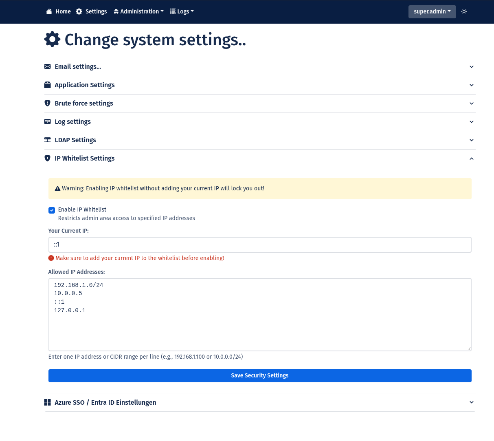
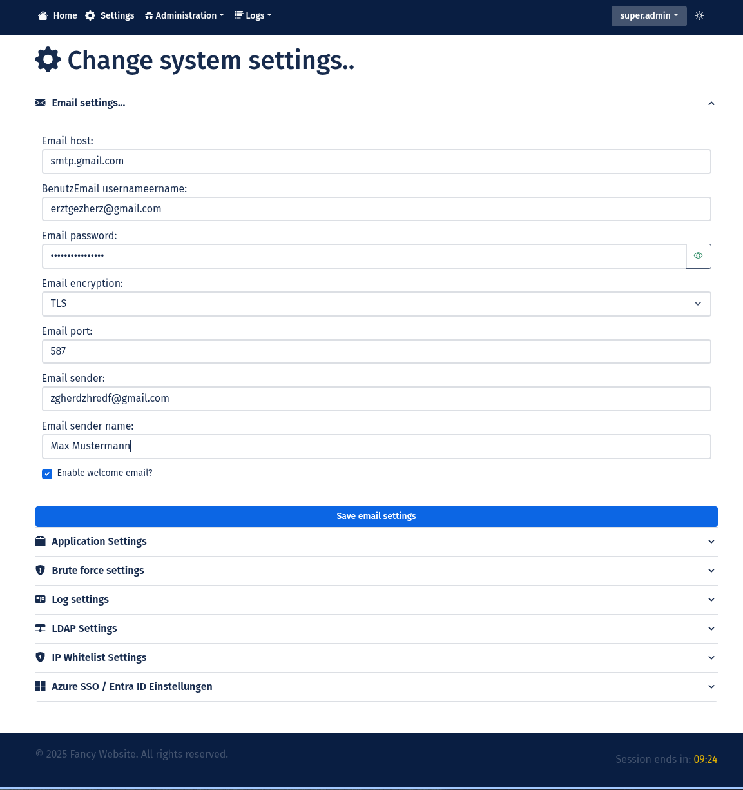
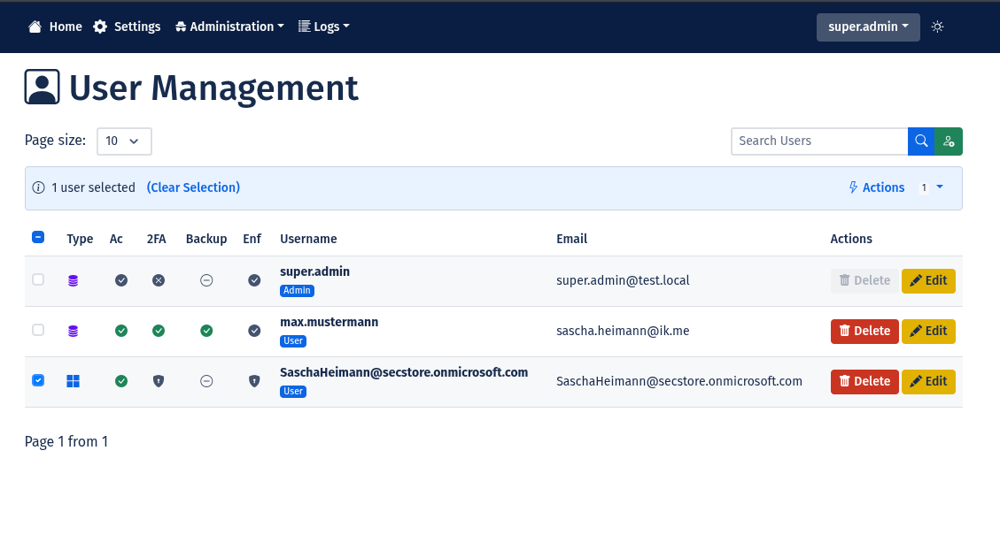

# 📘 SecStore User Manual

**Version 1.4.0** | Last Updated: January 2025

---

## 📋 Table of Contents

1. [Introduction](#1-introduction)
2. [Installation](#2-installation)
3. [Basic Configuration with Setup Wizard](#3-basic-configuration-with-setup-wizard)
4. [Application Configuration via Admin Pages](#4-application-configuration-via-admin-pages)
5. [Administration](#5-administration)
6. [Logs](#6-logs)
7. [Login](#7-login)
8. [User Profile](#8-user-profile)

---

## 1. Introduction

### 1.1 What is SecStore?

**SecStore** is a modern, security-focused authentication framework for PHP-based web applications. It is designed as a **boilerplate** to provide developers with a solid foundation for secure web applications without having to implement security features from scratch.

### 1.2 Core Principles

SecStore consistently follows these principles:

#### **🔐 Security-First Approach**
- **Zero-Trust Architecture**: Every request is validated, every session is monitored
- **Defense in Depth**: Multi-layered security measures (CSRF, Rate Limiting, Brute Force Protection)
- **Secure by Default**: Secure default settings, conscious decision required for less secure options

#### **🏗️ MVC Architecture**
- **Model-View-Controller Pattern**: Clear separation of data model, presentation, and logic
- **Middleware Stack**: Modular request processing (Rate Limiting → CSRF → Auth → Authorization)
- **Utility Layer**: Reusable helper classes for Session, Logging, Security, etc.

#### **🛡️ Implemented Security Features**

##### **Authentication**
- **Multi-Level Authentication**:
  - Local authentication (BCRYPT hashing with 60 characters)
  - LDAP integration for enterprise environments
  - Azure SSO / Entra ID for Single Sign-On
- **Two-Factor Authentication (2FA)**:
  - TOTP standard (Time-based One-Time Password)
  - QR code setup with manual key fallback
  - Backup codes for emergencies (single-use)
  - Admin-side 2FA enforcement per user

##### **Session Security**
- **Session Fingerprinting**: Linked to User-Agent and Accept-Language headers
- **Automatic Session ID Regeneration**: Every 30 minutes
- **Timeout Control**: Configurable inactivity timeouts
- **Secure Cookies**: HttpOnly, Secure, SameSite flags

##### **Attack Prevention**
- **CSRF Protection**: Token-based with intelligent rotation
  - Rotation for critical routes (Login, Password Change, 2FA)
  - No rotation for UX-critical operations (Bulk Actions)
- **Rate Limiting**: Granular limits by scope
  - Login: 5 attempts / 5 minutes
  - Admin: 200 requests / 5 minutes
  - Global: 1500 requests / 5 minutes
- **Brute Force Protection**: IP + Email tracking with configurable lockout
- **SQL Injection Prevention**: Prepared statements via Paris ORM
- **XSS Prevention**: Auto-escaping via Latte Template Engine
- **Content Security Policy (CSP)**: No inline scripts/styles allowed

##### **Audit & Monitoring**
- **Comprehensive Logging**:
  - 7 log types: ERROR, AUDIT, REQUEST, SYSTEM, MAIL, SQL, SECURITY
  - IP tracking for all security events
  - Context-based logs (Controller/Method)
- **Security Analytics**:
  - Login patterns (Hourly, Daily, Weekly)
  - Security score calculation
  - Anomaly detection (Suspicious IPs, Rapid Failures)
  - Real-time security dashboard

#### **🎨 User-Friendliness**

- **Responsive Design**: Bootstrap 5, optimized for Desktop, Tablet, Mobile
- **Dark/Light Mode**: User preference with cookie persistence
- **Multi-Language**: German/English with automatic browser detection
- **Intuitive Navigation**: Clear structure, breadcrumbs, icons
- **Web-Based Setup Wizard**: 4-step setup without config file editing

#### **⚡ Performance & Scalability**

- **Lightweight Framework**: Flight PHP (~100KB)
- **Template Caching**: Latte compiles templates to PHP
- **Session-Based Storage**: No DB overhead for rate limiting
- **Optimized Queries**: ORM with query logging for performance analysis

### 1.3 Technology Stack

| Component | Technology | Version | Purpose |
|-----------|-----------|---------|---------|
| **Backend** | PHP | 8.3+ | Server-side logic |
| **Framework** | Flight PHP | Latest | Routing & HTTP handling |
| **Template Engine** | Latte | Latest | View rendering with auto-escaping |
| **Database** | MySQL/MariaDB | 8.0+ / 10.4+ | Data persistence |
| **ORM** | Paris/Idiorm | Latest | Active Record & Query Builder |
| **Frontend** | Bootstrap 5 | Latest | UI framework |
| **Icons** | Bootstrap Icons | Latest | Icon set |
| **Email** | PHPMailer | Latest | SMTP sending |
| **2FA** | RobThree TwoFactorAuth | Latest | TOTP implementation |

### 1.4 What SecStore is NOT

- **Not** a ready-made CMS (Content Management System)
- **Not** an e-commerce solution
- **Not** a classic REST API (primarily server-side rendering)
- **Not** a microservice framework

SecStore is a **boilerplate** - a **foundation** on which you build your individual application.

---

## 2. Installation

SecStore can be installed in different ways. The **recommended method** is Docker installation as it provides the easiest and fastest way.

### 2.1 Installation via Docker (Recommended)

For complete Docker installation instructions, see:  
👉 **[README_DOCKER.md](README_DOCKER.md)**

**Quick Start:**

```bash
# Clone repository
git clone https://github.com/madcoda9000/SecStore.git
cd SecStore

# Configure environment variables
cp .env.example .env

# Start containers
docker-compose up -d

# Open browser
http://localhost:8000
```

The setup wizard starts automatically.

### 2.2 Manual Installation

For complete manual installation instructions, see:  
👉 **[INSTALL.md](INSTALL.md)**

**Overview:**

1. **Check system requirements** (PHP 8.3+, MySQL 8.0+, Webserver)
2. **Clone project** (`git clone https://github.com/madcoda9000/SecStore.git`)
3. **Run auto-setup script** (`./secstore_setup.sh`)
4. **Install Git hooks** (`./setup-hooks.sh`)
5. **Configure webserver** (Apache/Nginx Virtual Host)
6. **Run setup wizard in browser** (`http://localhost:8000/setup`)

---

## 3. Basic Configuration with Setup Wizard

SecStore features a **4-step web setup wizard** that guides you through the initial configuration. The wizard is **automatically** invoked when SecStore detects missing or incomplete configuration.

### 3.1 Wizard Access

The setup wizard is accessible at these URLs:

| URL | Purpose |
|-----|---------|
| `http://your-domain.com/` | Main entry point - automatically redirects to `/setup` if needed |
| `http://your-domain.com/setup` | Direct access to setup wizard |
| `http://localhost:8000/` | Local development server |

> **💡 Note:** After successful setup, the wizard is automatically disabled for security reasons.

### 3.2 Step 1: Check Configuration File


**What is checked:**
- Does `config.php` exist in the main directory?
- Is `config.php` present?

**Possible States:**

#### ✅ **State: File exists**
- Wizard automatically continues to Step 2

#### ❌ **State: File missing**
- **Display:** Error message "Configuration file missing"
- **Instructions:** Wizard shows exact commands to copy:
  ```bash
  cp config.php_TEMPLATE config.php
  chmod 640 config.php
  chown www-data:www-data config.php
  ```
- **Environment Details:** Collapsible section shows:
  - Detected Web User (e.g., `www-data`)
  - Docker: Yes/No
  - Windows: Yes/No
  - Suggested Permissions (e.g., `664` for Docker)

**After execution:**
- Click "Check Again" button
- Wizard re-checks and continues

### 3.3 Step 2: Check File Permissions


**What is checked:**
- Is `config.php` writable by the webserver?

**Possible States:**

#### ✅ **State: File writable**
- Wizard automatically continues to Step 3

#### ❌ **State: No write permissions**
- **Display:** Warning "Permission denied"
- **Instructions:** Wizard shows commands to set permissions:
  ```bash
  chmod 640 config.php
  chown www-data:www-data config.php  # Linux
  # OR
  chown apache:apache config.php      # RHEL/CentOS
  ```
- **Environment Details:** Shows detected environment and recommended permissions

**After execution:**
- Click "Check Again" button

### 3.4 Step 3: Configure Database


**Form Fields:**

| Field | Description | Example | Default (Docker) |
|-------|-------------|---------|------------------|
| **Database Host** | DB server hostname | `localhost` | `db` |
| **Database Name** | Database name | `secstore` | `secstore` |
| **Username** | DB username | `secstore_user` | `secstore` |
| **Password** | DB password | `*****` | From `.env` |

**What happens on submit:**

1. **Connection Test**: Wizard tests database connection
2. **Error Handling**:
   - On error: Error message with details (e.g., "Connection refused", "Access denied")
   - Form remains filled for correction
3. **Schema Creation**: On successful connection:
   - Creates all tables (`users`, `roles`, `failed_logins`, `logs`)
   - Creates indexes
   - Creates default roles (`Admin`, `User`)
   - Creates admin user:
     - Username: `super.admin`
     - Password: `Test1000!`
     - Email: `super.admin@test.local`
     - Role: `Admin`
4. **Save Configuration**: Writes DB credentials to `config.php`

**Success Display:**
- ✅ Green check icon
- "Database configured successfully"
- "All tables have been created and the database is ready."
- Button "Continue" → proceed to Step 4

### 3.5 Step 4: Configure Email (Optional)


**Info Box:**
> "Email settings are optional and can be configured later in the admin area."

**Form Fields:**

| Field | Description | Example |
|-------|-------------|---------|
| **SMTP Host** | Mail server hostname | `smtp.gmail.com` |
| **Port** | SMTP port | `587` (TLS) or `465` (SSL) |
| **Encryption** | Encryption type | `tls` or `ssl` |
| **Username** | SMTP username | `noreply@yourdomain.com` |
| **Password** | SMTP password | `*****` |
| **Sender Email** | From address | `noreply@yourdomain.com` |
| **Sender Name** | From name | `SecStore System` |
| **Enable Welcome Email** | Checkbox | ☑ Enabled |

**Two Options:**

#### Option 1: Configure Email
- **Process**:
  1. Fill form
  2. Click "Configure Email" button
  3. Wizard tests SMTP connection
  4. On success: Continue to "Setup Complete"
  5. On error: Error message (e.g., "SMTP connection failed: Authentication failed")

#### Option 2: Skip
- **Button:** "Skip (configure later in admin area)"
- **Process**:
  1. Wizard sets placeholder value `ANY_MAIL_HOST` in config
  2. Continues to "Setup Complete"
  3. Email can be configured later in admin settings

### 3.6 Setup Complete


**Success Message:**
- ✅ "Setup successfully completed!"
- "SecStore has been successfully installed and configured."

**Important Notice Box:**
> **⚠️ Important Notice:**
> 
> Log in with the following default credentials and **change the password immediately**:
> 
> - **Username:** `super.admin`
> - **Password:** `Test1000!`
> - **Email:** `super.admin@test.local`

**Button:** "Go to Login" → redirects to `/login`

---

## 4. Application Configuration via Admin Pages

After initial setup, all application settings can be configured via the web interface. Navigate to **Settings** in the admin menu.



The settings page uses an **accordion layout** with separate sections for each configuration area.

### 4.1 Email Settings



**Location:** Settings → Email settings (first accordion item)

**Purpose:** Configure SMTP server for sending emails (welcome mails, password resets, notifications)

**Form Fields:**

| Field | Description | Example | Required |
|-------|-------------|---------|----------|
| **Email host** | SMTP server hostname | `smtp.gmail.com` | Yes |
| **Email port** | SMTP port number | `587` (TLS) or `465` (SSL) | Yes |
| **Email username** | SMTP login username | `noreply@yourdomain.com` | Yes |
| **Email password** | SMTP login password | `*****` | Yes |
| **Email sender** | Sender email address | `noreply@yourdomain.com` | Yes |
| **Email sender name** | Display name for sender | `SecStore System` | Yes |
| **Email encryption** | Encryption method | `tls` or `ssl` | Yes |
| **Enable welcome email?** | Send email on registration | ☑ Checkbox | No |

**Process:**
1. Fill in SMTP credentials from your email provider
2. Select encryption type (`tls` for port 587, `ssl` for port 465)
3. Optionally enable welcome emails
4. Click "Save email settings"
5. Settings are saved to `config.php`
6. Success message: "Settings saved successfully!"

**Common SMTP Providers:**

| Provider | Host | Port | Encryption |
|----------|------|------|------------|
| Gmail | `smtp.gmail.com` | 587 | TLS |
| Outlook/Office365 | `smtp.office365.com` | 587 | TLS |
| SendGrid | `smtp.sendgrid.net` | 587 | TLS |
| Mailgun | `smtp.mailgun.org` | 587 | TLS |

### 4.2 Application Settings


**Location:** Settings → Application Settings (second accordion item)

**Purpose:** Configure core application behavior

**Form Fields:**

| Field | Description | Example | Default |
|-------|-------------|---------|---------|
| **Application URL** | Base URL of your application | `https://yourdomain.com` | `http://localhost:8000` |
| **Session timeout (in seconds)** | Inactivity timeout | `1800` (30 minutes) | `600` (10 minutes) |
| **Show register link on login page?** | Display registration link | ☑ Checkbox | Enabled |
| **Show password reset link on login page?** | Display reset link | ☑ Checkbox | Enabled |

**Field Details:**

##### **Application URL**
- Used for generating links in emails (password reset, verification)
- Should match your actual domain
- Include protocol (`http://` or `https://`)
- No trailing slash

##### **Session Timeout**
- Time in seconds before inactive session expires
- Minimum: 300 (5 minutes)
- Maximum: 86400 (24 hours)
- Recommended: 1800 (30 minutes)

##### **Show register link**
- If enabled: "Register" link visible on login page
- If disabled: Direct registration URL (`/register`) still works but hidden
- Use case: Disable for invite-only systems

##### **Show password reset link**
- If enabled: "Forgot password?" link visible on login page
- If disabled: Reset URL (`/forgot-password`) still works but hidden
- Use case: Disable if using only LDAP/SSO authentication

**Process:**
1. Update desired fields
2. Click "Save application settings"
3. Settings saved to `config.php`
4. Success message appears

### 4.3 Brute Force Settings


**Location:** Settings → Brute force settings (third accordion item)

**Purpose:** Configure brute force attack protection for login attempts

**Form Fields:**

| Field | Description | Example | Default |
|-------|-------------|---------|---------|
| **Enable brute force protection?** | Master switch | ☑ Checkbox | Enabled |
| **Lockout time (in seconds)** | Duration of account lock | `900` (15 minutes) | `1000` |
| **Maximum failed login attempts** | Attempts before lockout | `5` | `5` |

**How it works:**

1. **Tracking:** System tracks failed login attempts per:
   - Email/Username combination
   - IP address
   - Timestamp

2. **Lockout Trigger:**
   - If user exceeds max attempts within lockout window
   - Account is temporarily locked

3. **Lockout Duration:**
   - User cannot login for specified time
   - Even with correct password
   - Timer shown in error message

4. **Automatic Unlock:**
   - After lockout time expires
   - Counter resets
   - User can attempt login again

**Recommended Settings:**

| Use Case | Max Attempts | Lockout Time |
|----------|-------------|--------------|
| **High Security** | 3 | 1800 (30 min) |
| **Balanced** | 5 | 900 (15 min) |
| **User-Friendly** | 10 | 300 (5 min) |

**Process:**
1. Enable/disable protection with checkbox
2. Set max attempts (1-20 reasonable range)
3. Set lockout duration in seconds
4. Click "Save brute force settings"

### 4.4 Log Settings


**Location:** Settings → Log settings (fourth accordion item)

**Purpose:** Control which types of events are logged to database

**Form Fields:**

| Field | Description | Recommended |
|-------|-------------|-------------|
| **Enable system log?** | System events (startup, shutdown, errors) | ☑ Always ON |
| **Enable access log?** | Audit trail (logins, logouts, changes) | ☑ Always ON |
| **Enable database logging?** | SQL queries | ⚠️ Dev only |
| **Enable request logging?** | Every HTTP request | ⚠️ Dev only |
| **Enable email logging?** | Sent emails | ☑ Recommended |

**Warning Notes:**

> **⚠️ NOTE:** Request logging can generate a large number of log entries in a very short time! Use for debugging only.

> **⚠️ NOTE:** Database logging can generate a large number of log entries in a very short time! Use for debugging only.

**Log Types Explained:**

##### **System Log** (`enableSystemLogging`)
- Application startup/shutdown
- Configuration changes
- System errors
- **Storage:** `logs` table with `type = 'SYSTEM'`
- **Impact:** Low - minimal entries

##### **Access/Audit Log** (`enableAuditLogging`)
- User logins/logouts
- Password changes
- 2FA setup
- Admin actions (create/delete user)
- **Storage:** `logs` table with `type = 'AUDIT'`
- **Impact:** Medium - per user action

##### **Database Log** (`enableDatabase`)
- Every SQL query executed
- Query parameters
- Execution time
- **Storage:** `logs` table with `type = 'SQL'`
- **Impact:** ⚠️ VERY HIGH - hundreds per page load
- **Use:** Only for debugging performance issues

##### **Request Log** (`enableRequestLogging`)
- Every HTTP request
- Method, URI, IP
- User agent
- **Storage:** `logs` table with `type = 'REQUEST'`
- **Impact:** ⚠️ VERY HIGH - one per page/API call
- **Use:** Only for debugging routing issues

##### **Email Log** (`enableMailLogging`)
- Every sent email
- Recipient, subject
- Success/failure
- **Storage:** `logs` table with `type = 'MAIL'`
- **Impact:** Low - only when emails sent

**Recommended Production Settings:**
```
System Log:    ☑ ON
Audit Log:     ☑ ON
Database Log:  ☐ OFF
Request Log:   ☐ OFF
Email Log:     ☑ ON
```

**Process:**
1. Check/uncheck desired log types
2. Click "Save log settings"
3. Changes take effect immediately

### 4.5 LDAP Settings


**Location:** Settings → LDAP Settings (fifth accordion item)

**Purpose:** Configure LDAP/Active Directory integration for enterprise authentication

**Form Fields:**

| Field | Description | Example |
|-------|-------------|---------|
| **LDAP Host** | LDAP server hostname | `ldap.company.com` |
| **LDAP Port** | LDAP port | `389` (unencrypted) or `636` (encrypted) |
| **Domain Prefix** | Domain prefix for authentication | `COMPANY\` |

**How LDAP Authentication Works:**

1. **User Login:**
   - User enters username + password
   - System checks if LDAP is enabled for this user (per-user setting)

2. **LDAP Authentication:**
   - If enabled: Password validated against LDAP server
   - If disabled: Password validated against local database

3. **Connection:**
   - System connects to `{LDAP Host}:{LDAP Port}`
   - Attempts bind with `{Domain Prefix}{username}` + password
   - Example: `COMPANY\john.doe` with user's password

4. **Result:**
   - Success: User logged in
   - Failure: Login denied

**Configuration Examples:**

##### **Active Directory (Windows)**
```
LDAP Host:      ad.company.local
LDAP Port:      636
Domain Prefix:  COMPANY\
```

##### **OpenLDAP**
```
LDAP Host:      ldap.company.com
LDAP Port:      389
Domain Prefix:  (leave empty)
```

**Port Selection:**

| Port | Encryption | Use Case |
|------|------------|----------|
| **389** | None (LDAP) | Internal networks, testing |
| **636** | SSL/TLS (LDAPS) | **Production (recommended)** |

**Process:**
1. Enter LDAP server details
2. Enter domain prefix (include backslash for AD)
3. Click "Save LDAP Settings"
4. Test by enabling LDAP for a test user (User Management)

**Per-User LDAP:**
- LDAP is **not** enabled globally
- Each user has "Enable LDAP login?" checkbox
- Admin enables LDAP per user in User Management
- Users can have: Local auth, LDAP auth, **OR** Azure SSO (not multiple)

### 4.6 IP Whitelist Settings


**Location:** Settings → Security Settings (within accordion)

**Purpose:** Restrict admin panel access to specific IP addresses/ranges

**Form Fields:**

| Field | Description | Example |
|-------|-------------|---------|
| **Enable IP Whitelist?** | Master switch for whitelist | ☑ Checkbox |
| **Admin IP Whitelist** | Comma or newline separated IPs | See below |
| **Your Current IP** | Display your IP for reference | `192.168.1.100` |

**IP Format Options:**

##### **Single IP Address**
```
192.168.1.100
```

##### **CIDR Range** (Subnet)
```
192.168.1.0/24
```
- Allows entire `192.168.1.0` to `192.168.1.255` range

##### **Multiple Entries**
```
192.168.1.100
10.0.0.50
172.16.0.0/16
```

**How It Works:**

1. **When Disabled:**
   - All IPs can access admin panel
   - Only authentication required

2. **When Enabled:**
   - **Admin routes checked:** `/admin/*`
   - IP must be in whitelist **AND** user authenticated
   - Non-whitelisted IP: HTTP 403 Forbidden
   - Regular users not affected (no whitelist check)

**Configuration Example:**

```
# Office network
192.168.1.0/24

# VPN gateway
10.0.0.5

# Home IP
203.0.113.50
```

**⚠️ Important Notes:**

- **Always include your current IP** before enabling!
- Displayed IP shows your connection IP
- Test from another IP before enabling in production
- If locked out: Edit `config.php` manually to disable

**Process:**
1. Check "Enable IP Whitelist?" if desired
2. Add allowed IPs (one per line or comma-separated)
3. Verify your IP is included
4. Click "Save Security Settings"
5. Test access from allowed/disallowed IP

### 4.7 Azure / Entra ID SSO Settings


**Location:** Settings → Azure SSO / Entra ID Settings (last accordion item)

**Purpose:** Configure Azure Active Directory / Entra ID Single Sign-On

**Form Fields:**

| Field | Description | Where to Find |
|-------|-------------|---------------|
| **Activate Azure SSO?** | Master switch | Checkbox |
| **Tenant ID** | Azure AD Tenant ID (GUID) | Azure Portal → Azure AD → Overview |
| **Client ID (Application ID)** | App registration client ID | Azure Portal → App Registrations → Your App |
| **Client Secret** | Client secret value | Azure Portal → App Registrations → Certificates & secrets |
| **Redirect URI** | OAuth callback URL | Must match app registration |

**Redirect URI Format:**
```
https://your-domain.com/auth/azure/callback
```
- Must be HTTPS in production
- Must exactly match Azure app registration
- No trailing slash

**Setup Process:**

##### **Step 1: Azure Portal Configuration**
1. Go to Azure Portal → Azure Active Directory
2. Navigate to "App registrations" → "New registration"
3. Register application:
   - Name: `SecStore`
   - Supported account types: "Accounts in this organizational directory only"
   - Redirect URI: `https://your-domain.com/auth/azure/callback`
4. Note down:
   - Application (client) ID
   - Directory (tenant) ID
5. Create client secret:
   - Go to "Certificates & secrets"
   - "New client secret"
   - Description: "SecStore Auth"
   - Expiry: Choose duration
   - Copy secret **value** (only shown once!)
6. Configure API permissions:
   - "API permissions" → "Add a permission"
   - Microsoft Graph → Delegated permissions
   - Select: `User.Read`, `email`, `profile`, `openid`
   - "Grant admin consent"

##### **Step 2: SecStore Configuration**
1. Navigate to Settings → Azure SSO Settings
2. Check "Activate Azure SSO?"
3. Enter Tenant ID (GUID format)
4. Enter Client ID (GUID format)
5. Enter Client Secret (string value)
6. Enter Redirect URI (must match Azure registration)
7. Click "Save Azure SSO Settings"

##### **Step 3: Enable for Users**
1. Go to Admin → Users
2. Edit user
3. Check "Activate Entra ID Logon"
4. Save user

**How SSO Login Works:**

1. **User clicks "Sign in with Microsoft"** on login page
2. **Redirect to Azure:** User sent to Microsoft login
3. **User authenticates** with Microsoft credentials
4. **Azure redirects back** to SecStore callback URL
5. **SecStore validates token** and email
6. **User must exist** in SecStore with:
   - Matching email address
   - `entraIdEnabled = 1` flag
7. **User logged in** (no password required)

**⚠️ Important Notes:**

- **Email must match:** Azure email = SecStore username
- **Mutual exclusion:** User cannot have both LDAP **and** Azure enabled
- **Password disabled:** Users with Azure SSO cannot change password in SecStore
- **2FA managed by Azure:** SecStore 2FA disabled for Azure users
- **Mock Mode:** For development testing without Azure (set `mockMode = true` in `config.php`)

**Process:**
1. Complete Azure Portal setup first
2. Enter all credentials in SecStore
3. Enable SSO master switch
4. Save settings
5. Enable Azure SSO for individual users
6. Test login with "Sign in with Microsoft" button

---

## 5. Administration

The administration section is accessible to users with the **Admin** role. Navigate via the **Administration** menu in the top navigation bar.

### 5.1 User Management



**Location:** Administration → Users

**Purpose:** Create, edit, delete, and manage user accounts

#### 5.1.1 User List

**Features:**

| Feature | Description |
|---------|-------------|
| **Search** | Search by username, email, first name, last name |
| **Pagination** | Navigate through pages, configurable page size (10/25/50/100) |
| **Sorting** | Click column headers to sort |
| **Bulk Actions** | Select multiple users for batch operations |
| **CSV Export** | Export all users to CSV file |

**User Table Columns:**

| Column | Description | Icons |
|--------|-------------|-------|
| **Checkbox** | Select for bulk actions | ☐ |
| **Username** | Login username | - |
| **Email** | Email address | - |
| **Name** | First and Last name | - |
| **Roles** | Assigned roles (comma-separated) | - |
| **Status** | Account status | ✅ Enabled / ❌ Disabled |
| **MFA** | Two-factor auth status | 🔒 Enabled / 🔓 Disabled |
| **LDAP** | LDAP authentication | 🔐 Yes / - No |
| **Azure** | Azure SSO enabled | ☁️ Yes / - No |
| **Actions** | Quick actions | 👁️ ✏️ 🗑️ |

**Action Buttons:**

| Button | Icon | Action |
|--------|------|--------|
| **View/Edit** | ✏️ | Open user edit form |
| **Delete** | 🗑️ | Delete user (with confirmation) |

#### 5.1.2 Create New User


**Button:** "Create New User" (top right)

**Form Fields:**

| Field | Description | Validation |
|-------|-------------|------------|
| **First name** | User's first name | Required, 1-255 chars |
| **Last name** | User's last name | Required, 1-255 chars |
| **Email** | Email address | Required, valid email format |
| **Username** | Login username | Required, alphanumeric + `_-.` |
| **Roles** | Select one or more roles | At least one required |
| **Status** | Account active/disabled | ☑ Active (default) |
| **Password** | Initial password | Min 12 chars, uppercase, lowercase, number |
| **Enable LDAP login?** | Use LDAP auth | Checkbox |
| **Activate Entra ID Logon** | Use Azure SSO | Checkbox (grayed out if SSO not configured) |

**Role Selection Rules:**

1. **User role:** Cannot be combined with other roles
2. **Admin role:** Cannot be combined with other roles  
3. **Custom roles:** Can be combined with each other
4. **At least one:** Must select at least one role

**Password Hint:**
> If you enable LDAP for this user, simply generate a password of your choice. The password will not be used during login. Instead, the user must use their LDAP password when logging in.

**Authentication Type Restrictions:**
- User can have: **Local** OR **LDAP** OR **Azure SSO**
- Cannot combine LDAP and Azure
- Error shown if trying to enable both

**Process:**
1. Click "Create New User"
2. Fill all required fields
3. Select roles (multi-select dropdown)
4. Set password (required even for LDAP/Azure users)
5. Optionally enable LDAP or Azure SSO
6. Click "Save user"
7. Success message: "User created successfully!"

#### 5.1.3 Edit User


**Access:** Click edit icon (✏️) on any user

**Form Fields:** Same as Create, plus:

| Field | Description |
|-------|-------------|
| **Password** | Optional - only if changing | Hint: Leave blank to keep current password |

**Additional Actions (Buttons):**

| Action | Description | Availability |
|--------|-------------|--------------|
| **Disable/Enable MFA** | Turn off 2FA for user | If MFA enabled |
| **Enforce/Unenforce MFA** | Require user to set up 2FA | Always |
| **Reset Backup Codes** | Generate new 2FA backup codes | If MFA enabled |
| **Disable/Enable User** | Deactivate/activate account | Always |

**Password Field Behavior:**
- **Blank:** Password unchanged
- **Filled:** Password updated to new value
- **LDAP/Azure users:** Password still required but not used for login

**Process:**
1. Click edit icon for user
2. Modify desired fields
3. Leave password blank if not changing
4. Click "Save user"
5. Success: "User updated successfully!"

#### 5.1.4 Bulk Actions


**Purpose:** Perform actions on multiple users simultaneously

**How to use:**
1. Select users with checkboxes (select all available in header)
2. Choose action from "Bulk Actions" dropdown
3. Click "Apply"
4. Confirm action in modal dialog

**Available Bulk Actions:**

| Action | Description | Confirmation |
|--------|-------------|--------------|
| **Delete Selected** | Permanently delete users | ⚠️ Yes - shows count |
| **Enable Selected** | Activate user accounts | Yes |
| **Disable Selected** | Deactivate user accounts | Yes |
| **Enforce 2FA** | Require 2FA setup on next login | Yes |
| **Unenforce 2FA** | Remove 2FA requirement | Yes |

**Bulk Delete:**
- Cannot delete your own account
- Cannot delete if you're the last admin
- Confirmation modal shows number of users

**Success Message:**
- "X users processed successfully"
- Shows breakdown: succeeded, failed, skipped

#### 5.1.5 Export Users

**Button:** "Export CSV" (top right)

**What is exported:**
- All users (not just current page)
- Respects current search filter
- All columns including:
  - ID, Username, Email, First Name, Last Name
  - Roles, Status, MFA Status, LDAP, Azure
  - Created Date

**File Format:**
- UTF-8 encoded CSV
- Excel-compatible (BOM included)
- Filename: `users_export_YYYY-MM-DD_HH-MM-SS.csv`

**Process:**
1. Optionally apply search filter
2. Click "Export CSV"
3. Browser downloads file automatically

### 5.2 Role Management


**Location:** Administration → Roles

**Purpose:** Create and delete custom roles for granular access control

**Built-in Roles:**

| Role | Description | Deletable |
|------|-------------|-----------|
| **Admin** | Full system access | ❌ No |
| **User** | Standard user role | ❌ No |

**Custom Roles:**
- Created by admins
- Can be assigned to users
- Can be deleted (if not in use)
- Examples: `Manager`, `Support`, `Auditor`

#### 5.2.1 Role List

**Features:**
- Search roles by name
- Pagination
- Create new role
- Delete custom roles

**Table Columns:**

| Column | Description |
|--------|-------------|
| **Role Name** | Display name of role |
| **Actions** | Delete button (for custom roles) |

#### 5.2.2 Create New Role


**Button:** "Create New Role"

**Modal Form:**

| Field | Validation |
|-------|------------|
| **Role Name** | Required, alphanumeric + spaces, 1-255 chars, unique |

**Process:**
1. Click "Create New Role"
2. Enter role name in modal
3. Click "Create"
4. Success: "Role successfully created!"
5. Role appears in list

**Use Case Example:**
```
Role: Support
Assigned to: Support team members
Purpose: Limited admin access for user support
```

#### 5.2.3 Delete Role


**Button:** Delete icon (🗑️) next to role

**Validation:**
- ❌ Cannot delete if assigned to any user
- Error: "Cannot be deleted because it is still assigned to users!"
- ✅ Can delete if no users have this role

**Confirmation Modal:**
- "Are you sure you want to delete the role [Name]?"
- Shows role name
- Irreversible action

**Process:**
1. Click delete icon
2. Confirm in modal
3. If in use: Error message
4. If not in use: "Successfully deleted!"

### 5.3 Rate Limit Management


**Location:** Administration → Rate Limits

**Purpose:** Configure and monitor rate limiting rules

**What is Rate Limiting:**
- Prevents abuse by limiting requests per time window
- Tracks by IP + User-Agent hash
- Different limits for different route scopes
- Automatic violation tracking and blocking

#### 5.3.1 Rate Limit Settings

**Scopes and Default Limits:**

| Scope | Default Limits | Purpose |
|-------|----------------|---------|
| **login** | 15 requests / 5 min | Login attempts |
| **register** | 5 requests / 5 min | Registration attempts |
| **forgot-password** | 5 requests / 60 min | Password reset requests |
| **reset-password** | 5 requests / 60 min | Password reset attempts |
| **2fa** | 25 requests / 5 min | 2FA code attempts |
| **session-extend** | 20 requests / 15 min | Session refresh |
| **admin** | 200 requests / 5 min | Admin panel actions |
| **global** | 1500 requests / 5 min | Fallback for all other routes |

**Configuration Form:**

Each scope has two fields:

| Field | Description | Unit |
|-------|-------------|------|
| **Requests** | Maximum allowed requests | Number (1-10000) |
| **Window** | Time window | Seconds (60-3600) |

**Example:**
```
Login:
  Requests: 5
  Window:   300 (5 minutes)
  
= Max 5 login attempts per 5 minutes
```

**Process:**
1. Navigate to Rate Limits
2. Modify desired scope limits
3. Click "Update Settings"
4. Changes take effect immediately
5. Success: "Rate limit settings updated"

#### 5.3.2 Violations Monitor


**Tab:** "Violations"

**Purpose:** Monitor and manage rate limit violations in real-time

**Violations Table:**

| Column | Description |
|--------|-------------|
| **IP Address** | Violator's IP |
| **Scope** | Which limit was exceeded |
| **Count** | Number of violations |
| **Last Violation** | Timestamp of most recent |
| **Actions** | Reset or block |

**Actions:**

| Button | Action | Effect |
|--------|--------|--------|
| **Reset Limit** | Clear violation counter | User can access again immediately |
| **Clear All** | Remove all violations | Bulk reset all counters |

**Auto-Cleanup:**
- Old violations automatically removed
- Cleanup interval: 5 minutes (configurable)
- Violations older than window duration deleted

**Process:**
1. Navigate to Violations tab
2. Review violation list
3. Click "Reset Limit" for specific IP/scope
4. Or click "Clear All" to reset everything

#### 5.3.3 Live Statistics

**Tab:** "Live Stats"

**Real-time Metrics:**

| Metric | Description |
|--------|-------------|
| **Total Violations (24h)** | Count in last 24 hours |
| **Active Limits** | Currently rate-limited IPs |
| **Most Violated Scope** | Which limit hit most often |
| **Top Violators** | IPs with most violations |

**Refresh:** Auto-refreshes every 30 seconds

### 5.4 Security Dashboard


**Location:** Administration → Security Dashboard

**Purpose:** Real-time overview of security metrics and login analytics

#### 5.4.1 Security Score

**Display:** Large circular gauge (0-100)

**Calculation Factors:**

| Factor | Impact | Penalty |
|--------|--------|---------|
| **Failed Logins** | >50 in 24h | -10 points |
| **Failed Logins** | >100 in 24h | -20 points |
| **CSRF Violations** | Per violation | -5 points (max -30) |
| **High Alerts** | Per alert | -15 points |
| **Medium Alerts** | Per alert | -5 points |

**Score Ranges:**

| Score | Status | Color |
|-------|--------|-------|
| **90-100** | Excellent | 🟢 Green |
| **70-89** | Good | 🟡 Yellow |
| **50-69** | Warning | 🟠 Orange |
| **0-49** | Critical | 🔴 Red |

#### 5.4.2 24-Hour Summary Cards

**Metrics Displayed:**

| Card | Description | Icon |
|------|-------------|------|
| **Failed Logins** | Unsuccessful login attempts | 🔒 |
| **Successful Logins** | Successful authentications | ✅ |
| **Password Resets** | Reset requests | 🔑 |
| **New Registrations** | New user signups | 👤 |
| **CSRF Violations** | CSRF token failures | ⚠️ |
| **Rate Limit Hits** | Rate limit blocks | 🚫 |

**Display:** Grid of cards with numbers and trend indicators

#### 5.4.3 Login Analytics


**Charts Available:**

##### **Hourly Login Pattern (24h)**
- **Type:** Line chart
- **X-axis:** Hours (0-23)
- **Y-axis:** Number of logins
- **Data:** Failed vs Successful logins
- **Purpose:** Identify peak login times and attack patterns

##### **Weekly Login Trend (7 days)**
- **Type:** Bar chart
- **X-axis:** Days (Mon-Sun)
- **Y-axis:** Login count
- **Data:** Failed vs Successful
- **Purpose:** Week-over-week comparison

##### **Login Heatmap**
- **Type:** Heatmap grid
- **Rows:** Days of week
- **Columns:** Hours of day
- **Color:** Intensity of login activity
- **Purpose:** Identify unusual activity patterns

##### **Success Rate Gauge**
- **Type:** Percentage gauge
- **Formula:** (Successful / Total) × 100
- **Display:** Arc gauge with percentage
- **Purpose:** Quick health indicator

#### 5.4.4 Security Alerts

**Alert Types:**

| Level | Trigger | Example |
|-------|---------|---------|
| **HIGH** | >100 failed logins in 24h | "Unusual number of failed logins: 156" |
| **HIGH** | Suspicious IPs detected | "Suspicious IPs detected: 3" |
| **MEDIUM** | CSRF violations | "CSRF violations detected: 5" |

**Alert Display:**
- Color-coded boxes (red for HIGH, orange for MEDIUM)
- Alert type and count
- Recommendation text
- Time period

**Recommendations:**

| Alert | Recommendation |
|-------|----------------|
| **Excessive failures** | "Review logs for potential brute force attacks" |
| **Suspicious IPs** | "Consider blocking suspicious IP addresses" |
| **CSRF violations** | "Review application logs for potential attacks" |

#### 5.4.5 Time Range Selection

**Dropdown:** Select analysis period

| Option | Range | Use Case |
|--------|-------|----------|
| **1 Hour** | Last 60 minutes | Real-time monitoring |
| **24 Hours** | Last day | Default view |
| **7 Days** | Last week | Trend analysis |

**Auto-refresh:** Dashboard updates every 60 seconds

---

## 6. Logs

SecStore provides comprehensive logging with 7 different log categories. All logs are stored in the `logs` database table with searchable and exportable data.

**Location:** Logs menu (top navigation)

### 6.1 Log Categories

Each log type has a dedicated view with identical features but filtered data.

#### 6.1.1 Audit Logs


**Menu:** Logs → Audit Logs

**Purpose:** Track all user actions and administrative changes

**Logged Events:**
- User logins/logouts (success and failure)
- Password changes
- Email changes
- 2FA setup/disable
- User created/edited/deleted by admin
- Role assignments
- Settings changes
- Backup code regeneration

**Table Columns:**

| Column | Description |
|--------|-------------|
| **ID** | Unique log entry ID |
| **Date/Time** | When event occurred |
| **User** | Who performed action |
| **Context** | Controller/Method (e.g., `AuthController/login`) |
| **Message** | Detailed description |

**Example Entries:**
```
2025-01-15 14:32:15 | john.doe | AuthController/login | SUCCESS: User logged in successfully
2025-01-15 14:45:22 | super.admin | AdminController/updateUser | SUCCESS: updated user jane.smith
2025-01-15 15:10:01 | john.doe | ProfileController/changePassword | SUCCESS: Password changed
```

#### 6.1.2 Security Logs

**Menu:** Logs → Security Logs

**Purpose:** Track security-related events and potential threats

**Logged Events:**
- Brute force lockouts
- CSRF token violations
- Session hijacking attempts
- Suspicious login patterns
- Rate limit violations
- IP whitelist blocks
- Failed 2FA attempts

**Example Entries:**
```
2025-01-15 14:05:12 | SYSTEM | BruteForceUtil | Account locked: too many failed attempts for user: john.doe
2025-01-15 14:10:33 | attacker@bad.com | CsrfMiddleware | CSRF token mismatch from IP: 203.0.113.42
2025-01-15 14:15:44 | SYSTEM | SessionUtil | Suspicious session: fingerprint mismatch for user: jane.smith
```

#### 6.1.3 System Logs

**Menu:** Logs → System Logs

**Purpose:** Application-level events and errors

**Logged Events:**
- Application startup
- Configuration reloads
- Database connections
- File permission errors
- General application errors

#### 6.1.4 Request Logs

**Menu:** Logs → Request Logs

**Purpose:** HTTP request tracking (use only for debugging)

**Logged Events:**
- Every HTTP request
- Method (GET, POST, etc.)
- URI path
- IP address

**⚠️ Warning:** Generates massive amounts of data - disable in production

#### 6.1.5 Database Logs

**Menu:** Logs → Database Logs

**Purpose:** SQL query tracking (use only for debugging)

**Logged Events:**
- Every SQL query
- Query parameters
- Execution context

**⚠️ Warning:** Generates massive amounts of data - disable in production

#### 6.1.6 Mail Logs

**Menu:** Logs → Mail Logs

**Purpose:** Email sending tracking

**Logged Events:**
- Email sent successfully
- Email send failures
- Recipient address
- Subject line
- SMTP errors

**Example Entries:**
```
2025-01-15 14:00:01 | SYSTEM | MailUtil/sendMail | SUCCESS: Sent welcome email to: newuser@example.com
2025-01-15 14:05:12 | SYSTEM | MailUtil/sendMail | ERROR: SMTP connection failed for: baduser@invalid.com
```

#### 6.1.7 Error Logs

**Menu:** Logs → Error Logs

**Purpose:** Application errors and exceptions

**Logged Events:**
- PHP errors
- Exceptions
- Fatal errors
- Warning messages

### 6.2 Common Log Features

All log views share these features:

#### 6.2.1 Search

**Search Box:** Top-right of table

**Searchable Fields:**
- User
- Context
- Message

**Behavior:**
- Real-time search (searches as you type)
- Case-insensitive
- Partial matches
- Searches across all columns

**Example Searches:**
- `john.doe` - Find all actions by user
- `login` - Find all login-related events
- `FAILED` - Find all failures
- `192.168.1` - Find actions from IP range

#### 6.2.2 Pagination

**Controls:**

| Element | Function |
|---------|----------|
| **Page Size Dropdown** | Select 10, 25, 50, or 100 rows per page |
| **<< First** | Jump to first page |
| **< Previous** | Previous page |
| **Page Numbers** | Click to jump to specific page |
| **Next >** | Next page |
| **Last >>** | Jump to last page |

**Display:** "Showing X to Y of Z entries"

#### 6.2.3 Column Sorting

**How to sort:**
- Click column header to sort ascending
- Click again to sort descending
- Click third time to remove sort

**Sortable Columns:**
- ID
- Date/Time
- User
- Type
- Context

**Default Sort:** Date/Time descending (newest first)

### 6.3 Log Export


**Button:** "Export CSV" (top-right on each log page)

**What is exported:**
- All logs of current type (not just current page)
- Respects active search filter
- All columns: ID, Type, Date/Time, User, Context, Message

**File Format:**
- UTF-8 encoded CSV with BOM (Excel-compatible)
- Filename: `{type}_logs_export_YYYY-MM-DD_HH-MM-SS.csv`
- Examples:
  - `audit_logs_export_2025-01-15_14-30-00.csv`
  - `security_logs_export_2025-01-15_14-30-00.csv`

**Column Headers:**
```csv
ID,Type,Date/Time,User,Context,Message
```

**Example Row:**
```csv
1234,AUDIT,"2025-01-15 14:32:15",john.doe,"AuthController/login","SUCCESS: User logged in successfully"
```

**Process:**
1. Navigate to desired log type
2. Optionally apply search filter
3. Click "Export CSV"
4. File downloads automatically
5. Open in Excel or text editor

**Use Cases:**
- Compliance audits
- Security incident investigation
- Long-term archival
- Data analysis in Excel/BI tools

### 6.4 Log Truncate


**Button:** "Truncate Logs" (top-right on each log page)

**Purpose:** Delete ALL logs of current type to free database space

**Warning Modal:**
> ⚠️ **Warning!**
> 
> This will permanently delete **ALL {TYPE} logs** from the database.
> 
> This action **cannot be undone**.
> 
> Are you sure you want to continue?

**Buttons:**
- **Cancel** - Close modal, no action
- **Yes, Delete All Logs** - Proceed with deletion

**What happens:**
1. All logs of current type deleted from database
2. Cannot be recovered
3. Log table remains (only data deleted)
4. Success message: "All {type} logs have been deleted"

**Best Practice:**
1. **Export** logs first (for backup)
2. Then **truncate** to free space
3. Regular cleanup schedule (e.g., monthly)

**Recommended Truncate Schedule:**

| Log Type | Frequency | Reason |
|----------|-----------|--------|
| **Audit** | Every 3-6 months | Long-term compliance |
| **Security** | Every 3-6 months | Security analysis |
| **System** | Monthly | Less critical |
| **Request** | Daily/Weekly | Massive data |
| **Database** | Daily/Weekly | Massive data |
| **Mail** | Monthly | Moderate data |
| **Error** | Monthly | Keep for debugging |

---

## 7. Login

SecStore supports three authentication methods. The login page automatically shows available options based on system configuration.


### 7.1 Login as Database User

**Default method** for all users without LDAP or Azure SSO enabled.

**Login Form:**

| Field | Description |
|-------|-------------|
| **Username** | Your SecStore username |
| **Password** | Your SecStore password |

**Process:**
1. Navigate to login page (`/login`)
2. Enter username and password
3. Click "Login" button
4. **If 2FA enabled:** Redirected to 2FA verification page
5. **If 2FA disabled:** Logged in directly to dashboard

**Password Requirements:**
- Minimum 12 characters
- At least one uppercase letter
- At least one lowercase letter
- At least one number
- Special characters allowed

**Failed Login:**
- Error message: "Invalid username or password"
- Brute force protection applies after configured attempts
- Lockout message shows remaining time

**Forgot Password:**
- Link: "Forgot password?" (if enabled in settings)
- Redirects to `/forgot-password`
- Enter email to receive reset link

### 7.2 Login as LDAP User

**Requirement:** User account must have "LDAP Enabled" checkbox checked by admin.

**How it differs from DB login:**

| Aspect | DB User | LDAP User |
|--------|---------|-----------|
| **Form** | Same username/password form | Same form |
| **Password Validation** | Against SecStore database | Against LDAP server |
| **Password Storage** | Hashed in SecStore | Not stored (validated by LDAP) |
| **Password Change** | Via SecStore profile | Must use LDAP/AD tools |

**LDAP Login Process:**
1. User enters username and password
2. SecStore checks if LDAP enabled for this user
3. **If LDAP enabled:**
   - Password sent to LDAP server
   - LDAP bind attempt with `{Domain Prefix}{username}`
   - Example: `COMPANY\john.doe` + password
4. **If LDAP authentication succeeds:**
   - User logged into SecStore
   - Local password ignored
5. **If LDAP authentication fails:**
   - Login denied
   - Failed attempt recorded

**LDAP User Restrictions:**
- ❌ Cannot change password in SecStore
- ❌ Cannot use "Forgot Password" feature
- ✅ Can use 2FA (SecStore manages 2FA separately)
- ✅ Can change email in profile
- ✅ Can enable/disable dark mode

**Error Messages:**

| Error | Meaning |
|-------|---------|
| "Invalid username or password" | LDAP authentication failed |
| "LDAP connection failed" | Cannot reach LDAP server |
| "User not found" | Account doesn't exist in SecStore |

**Troubleshooting:**
- Verify LDAP settings in Admin → Settings → LDAP
- Check LDAP enabled for user in Admin → Users
- Verify network connectivity to LDAP server
- Check LDAP server logs for authentication attempts

### 7.3 Login as Azure SSO User

**Requirement:** 
- Azure SSO configured in Settings
- User account has "Entra ID Enabled" checkbox checked
- User email must match Azure AD email

**Login Button:**
- **Text:** "Sign in with Microsoft"
- **Icon:** Microsoft logo
- **Location:** Below standard login form
- **Visibility:** Only if Azure SSO enabled in config

**Azure SSO Login Process:**

1. **User clicks "Sign in with Microsoft"**
   - Redirected to Microsoft login page
   - URL: `https://login.microsoftonline.com/`

2. **User authenticates with Microsoft**
   - Enter Microsoft credentials
   - Complete MFA if required by Azure
   - Consent to permissions (first time only)

3. **Microsoft redirects back to SecStore**
   - Callback URL: `/auth/azure/callback`
   - Includes authorization code

4. **SecStore validates authentication**
   - Exchanges code for access token
   - Retrieves user email from Azure
   - Searches for user with matching email

5. **Login Success/Failure:**
   - ✅ **Success:** User with matching email + Entra ID enabled → Logged in
   - ❌ **Error "User not found":** Email doesn't match any user
   - ❌ **Error "Entra ID not enabled":** User exists but SSO not enabled for them

**Azure User Restrictions:**
- ❌ Cannot change password (managed by Azure)
- ❌ Cannot change email (managed by Azure)
- ❌ Cannot enable 2FA (managed by Azure)
- ✅ Can view profile information
- ✅ Can enable/disable dark mode
- ✅ Can view backup codes (if 2FA was previously enabled)

**Profile Page Warnings:**

When Azure user visits profile:
- 🔒 Password Change: "Password change not possible - Entra ID Authentication!"
- 📧 Email Change: "E-Mail change not possible - Entra ID Authentication!"
- 🔐 2FA Setup: "2FA-Setup not possible - 2FA is managed by Entra ID"

**Troubleshooting:**

| Error | Solution |
|-------|----------|
| "User not found" | Admin must create user with matching email and enable Entra ID |
| "Entra ID not enabled" | Admin must check "Activate Entra ID Logon" for user |
| "Invalid configuration" | Check Azure SSO settings (Tenant ID, Client ID, Secret) |
| "Redirect URI mismatch" | Verify redirect URI matches Azure app registration |

---

## 8. User Profile

All authenticated users can access their profile page to manage personal settings and security features.

**Location:** Click username in top-right → "Profile"

### 8.1 Profile as Database User


**Available Features:**

#### 8.1.1 View Personal Information

**Read-only Display:**
- Username
- Email address
- First name
- Last name
- Assigned roles
- Account status

#### 8.1.2 Change Password


**Accordion Section:** "Change password..."

**Form Fields:**

| Field | Validation |
|-------|------------|
| **Current Password** | Must match existing password |
| **New Password** | Min 12 chars, uppercase, lowercase, number |
| **Confirm Password** | Must match new password |

**Process:**
1. Expand "Change password..." section
2. Enter current password
3. Enter new password (twice)
4. Click "Change Password"
5. Success: "Password changed successfully"
6. Session remains active (no re-login required)

**Security:**
- Current password required (prevents unauthorized changes)
- Password strength validated
- CSRF token protected
- Logged to audit log

#### 8.1.3 Change Email

**Form Fields:**

| Field | Validation |
|-------|------------|
| **New Email** | Valid email format, unique in system |

**Process:**
1. Enter new email address
2. Click "Change Email"
3. Success: "Email changed successfully"
4. New email immediately active

**Verification:**
- No email verification required
- Change logged to audit log
- Admin can see change in logs

#### 8.1.4 Two-Factor Authentication (2FA)


**Status Display:**

| State | Display |
|-------|---------|
| **Not Set Up** | Button: "Enable 2FA" |
| **Enabled** | Badge: "2FA Enabled ✓"<br>Buttons: "Regenerate Backup Codes", "Disable 2FA" |
| **Enforced by Admin** | Badge: "2FA Enforced by Admin"<br>Cannot disable |

##### **Enable 2FA**


**Process:**

1. **Click "Enable 2FA" button**

2. **QR Code Page:**
   - QR code displayed for scanning
   - Manual key shown below (for manual entry)
   - Copy button for manual key
   - Instructions for authenticator app

3. **Recommended Authenticator Apps:**
   - Google Authenticator
   - Microsoft Authenticator
   - Authy
   - 1Password
   - LastPass Authenticator

4. **Scan QR Code:**
   - Open authenticator app
   - Select "Add account" or "Scan QR code"
   - Scan displayed QR code
   - **OR** manually enter key

5. **Backup Codes Display:**
   
   - 10 single-use backup codes shown
   - **⚠️ CRITICAL:** Codes shown only once!
   - Download button (saves as text file)
   - Print button (opens print dialog)

6. **Verify Setup:**
   - Enter 6-digit code from authenticator app
   - Click "Verify and Enable 2FA"
   - Success: 2FA enabled
   - Redirected to profile

**Next Login:**
- After username/password: 2FA code required
- Enter 6-digit code from app
- **OR** use backup code

##### **Regenerate Backup Codes**

**Button:** "Regenerate Backup Codes"

**Warning:**
> This will invalidate all existing backup codes. The user will need to generate new codes.

**Process:**
1. Click "Regenerate Backup Codes"
2. Confirm in modal
3. New set of 10 codes generated
4. Codes displayed (one-time view)
5. Download or print codes
6. Old codes immediately invalidated

**Use Cases:**
- Backup codes running low
- Security concern (codes may be compromised)
- Lost backup codes document

##### **Disable 2FA**

**Button:** "Disable and Reset 2FA"

**Availability:**
- ❌ **Not available** if enforced by admin
- ✅ **Available** if enabled by user

**Confirmation:**
> Are you sure you want to disable Two-Factor Authentication?
> 
> This will make your account less secure.

**Process:**
1. Click "Disable and Reset 2FA"
2. Confirm in modal
3. 2FA disabled
4. Backup codes deleted
5. Authenticator app entry can be removed
6. Next login: No 2FA required

##### **Backup Codes Counter**

**Display:** "X backup codes remaining"

**Behavior:**
- Updates after each backup code use
- Color coding:
  - 🟢 Green: 6+ codes
  - 🟡 Yellow: 3-5 codes
  - 🔴 Red: 1-2 codes

**Warning:** When ≤ 2 codes remaining:
> ⚠️ Low backup codes! Generate new ones soon.

**Auto-Warning:**
- Modal shown on login when ≤ 2 codes
- Suggests regenerating codes

#### 8.1.5 Theme Selection

**Toggle:** Dark Mode switch

**Options:**
- ☀️ Light Mode (default)
- 🌙 Dark Mode

**Persistence:**
- Saved in cookie
- Persists across sessions
- Per-user setting

### 8.2 Profile as LDAP User

**Differences from DB User:**

| Feature | DB User | LDAP User |
|---------|---------|-----------|
| **Change Password** | ✅ Available | ❌ Disabled with warning |
| **Change Email** | ✅ Available | ✅ Available |
| **Enable 2FA** | ✅ Available | ✅ Available |
| **Theme Selection** | ✅ Available | ✅ Available |

**Password Section:**

Instead of change form, warning displayed:
> 🔒 **Password-Change not possible - LDAP Authentication!**
> 
> Your password is managed by your organization's LDAP/Active Directory system. Please contact your IT department to change your password.

**Available Features:**
- ✅ View profile information
- ✅ Change email (SecStore email, not LDAP email)
- ✅ Enable/disable/manage 2FA
- ✅ Regenerate backup codes
- ✅ Change theme

**2FA Note:**
- LDAP users can still use SecStore 2FA
- 2FA is separate from LDAP authentication
- After LDAP password: 2FA code required
- Backup codes work normally

### 8.3 Profile as Azure SSO User


**Differences from other users:**

| Feature | DB User | LDAP User | Azure User |
|---------|---------|-----------|------------|
| **Change Password** | ✅ | ❌ | ❌ |
| **Change Email** | ✅ | ✅ | ❌ |
| **Enable 2FA** | ✅ | ✅ | ❌ |
| **View 2FA Status** | ✅ | ✅ | ✅ (read-only) |
| **Theme Selection** | ✅ | ✅ | ✅ |

**Warning Messages:**

##### **Password Section:**
> 🔒 **Password change not possible - Entra ID Authentication!**
> 
> Your password is managed by Microsoft Azure Active Directory. Please change your password through your organization's Microsoft account portal.

##### **Email Section:**
> 📧 **E-Mail change not possible - Entra ID Authentication!**
> 
> Your email address is managed by Microsoft Azure Active Directory and synced automatically.

##### **2FA Section:**
> 🔐 **2FA-Setup not possible - 2FA is managed by Entra ID**
> 
> Two-factor authentication is configured and enforced by your organization's Azure Active Directory policies.

**Available Features:**
- ✅ View all profile information (read-only)
- ✅ View assigned roles
- ✅ View 2FA status (if previously configured)
- ✅ View backup codes counter (if 2FA was enabled before Azure)
- ✅ Change theme (Light/Dark mode)
- ✅ Logout

**Read-Only Information:**
- Username (from Azure)
- Email (from Azure)
- First name (from Azure)
- Last name (from Azure)
- Roles (from SecStore)
- Account status

**Theme Preference:**
- Only user-controlled setting
- Saved locally in SecStore
- Not synced with Azure

---

## Appendix

### A. Default Credentials

**After initial setup:**

```
Username: super.admin
Password: Test1000!
Email:    super.admin@test.local
Role:     Admin
```

**⚠️ CRITICAL:** Change this password immediately after first login!

### B. Default Port Numbers

| Service | Port | Protocol |
|---------|------|----------|
| **HTTP** | 8000 | Development server |
| **HTTPS** | 443 | Production |
| **MySQL** | 3306 | Database |
| **LDAP** | 389 | Unencrypted |
| **LDAPS** | 636 | Encrypted (recommended) |
| **SMTP TLS** | 587 | Email |
| **SMTP SSL** | 465 | Email (alternative) |

### C. File Permissions

**Recommended permissions:**

| Path | Permission | Owner |
|------|------------|-------|
| `config.php` | 640 | www-data:www-data |
| `cache/` | 755 | www-data:www-data |
| `cache/*.php` | 644 | www-data:www-data |
| `public/` | 755 | www-data:www-data |

### D. Database Tables

| Table | Purpose |
|-------|---------|
| `users` | User accounts and authentication |
| `roles` | Role definitions |
| `failed_logins` | Brute force tracking |
| `logs` | All log entries (7 types) |

### E. Log Type Reference

| Type | Enum Value | Purpose |
|------|------------|---------|
| Audit | `AUDIT` | User actions |
| Security | `SECURITY` | Security events |
| System | `SYSTEM` | Application events |
| Request | `REQUEST` | HTTP requests |
| Database | `SQL` | SQL queries |
| Mail | `MAIL` | Email sending |
| Error | `ERROR` | Errors and exceptions |

### F. Support Resources

| Resource | URL |
|----------|-----|
| **Documentation** | [INSTALL.md](INSTALL.md) |
| **Developer Guide** | [DEVDOC.md](DEVDOC.md) |
| **Architecture** | [ARCHITECTURE.md](ARCHITECTURE.md) |
| **Security Policy** | [SECURITY.md](SECURITY.md) |
| **GitHub Issues** | https://github.com/madcoda9000/SecStore/issues |
| **Discussions** | https://github.com/madcoda9000/SecStore/discussions |

---

**End of User Manual**

*For developer documentation on extending SecStore, see [DEVDOC.md](DEVDOC.md)*