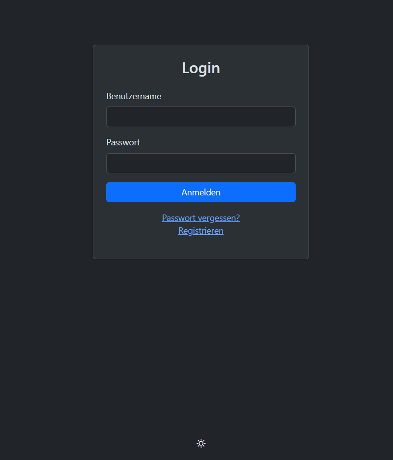
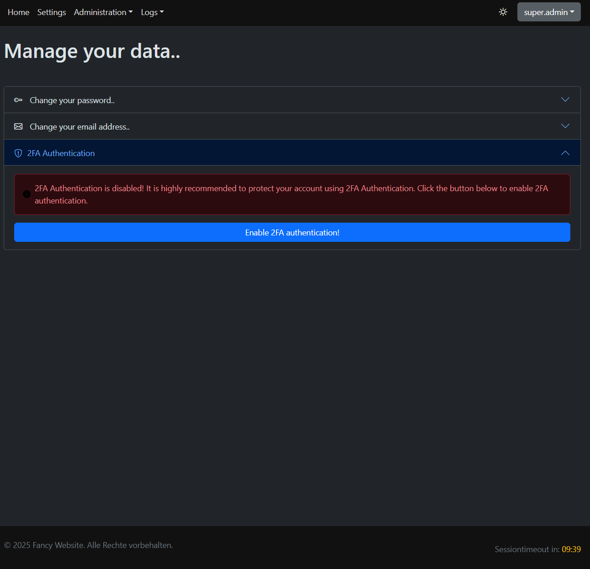
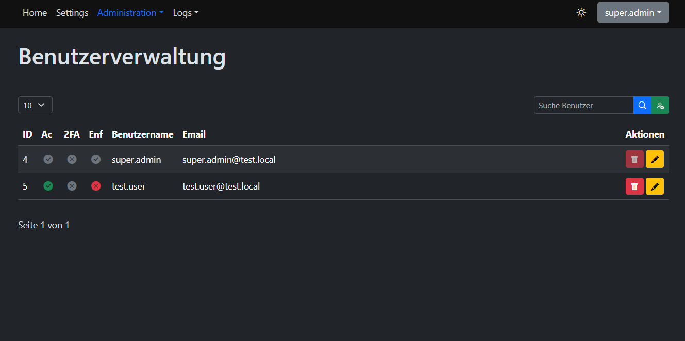
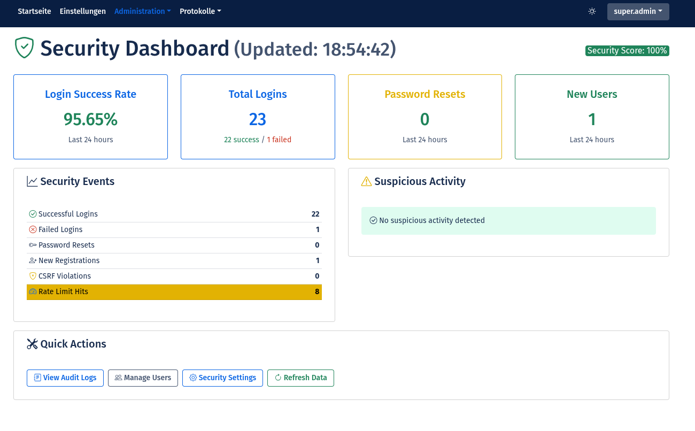
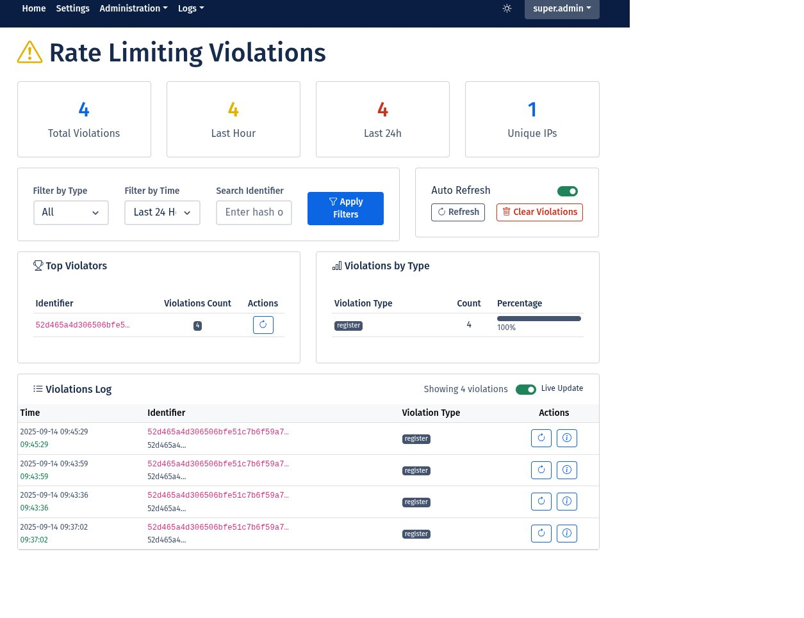
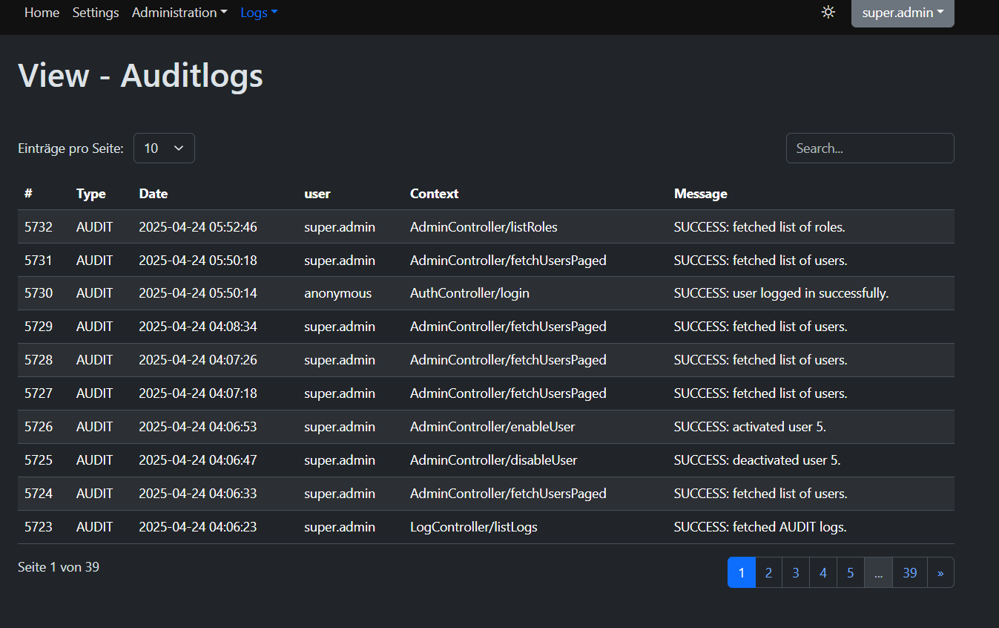
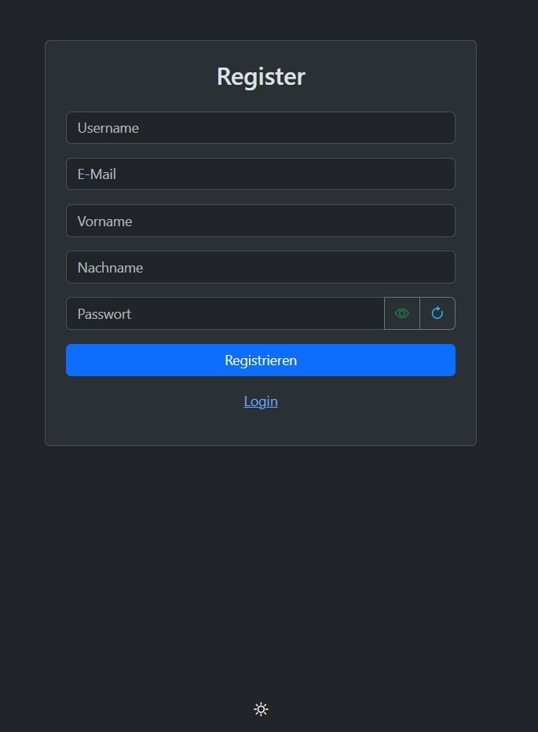

<div align="center">

# 🔐 SecStore
### *Secure authentication boilerplate for PHP web applications*

[](https://github.com/madcoda9000/SecStore/actions)
[](https://php.net)
[](LICENSE)
[](https://codecov.io/gh/madcoda9000/SecStore)
[](https://github.com/madcoda9000/SecStore/commits/main)
[](https://github.com/madcoda9000/SecStore)

**Production-ready authentication framework that saves you weeks of development. Features enterprise-grade security: 2FA/TOTP, LDAP integration, intelligent rate limiting, session fingerprinting, brute-force protection, security analytics dashboard, comprehensive audit logging, and granular role-based access control. Start building features, not infrastructure.**

[📚 Documentation](Documentation/INSTALL.md) • [🧑‍💻 Developer Documentation](Documentation/DEVDOC.md) • [🐛 Bug Reports](https://github.com/madcoda9000/SecStore/issues) • [💬 Discussions](https://github.com/madcoda9000/SecStore/discussions)

</div>

---

## ✨ Why SecStore?

<table>
<tr>
<td width="50%">

### 🛡️ **Security first**
- **Zero-Trust architecture** with session fingerprinting
- **2FA support** (TOTP) with QR code setup and backup codes
- **Advanced rate limiting** with intelligent scopes
- **IP-Whitelisting** with admin  interface
- **Security dashboard** Login Ananlytics, Security Events, 

</td>
<td width="50%">

### ⚡ **Developer Experience**
- **One-click installation** with automatic setup script
- **PSR-12 compliant** with code quality tools
- **GitHub Hooks** with automatic CHANGELOG.md update
- **Modern PHP 8.3+** with type declarations
- **Latte templates** for clean, secure views

</td>
</tr>
<tr>
<td>

### 🌐 **Enterprise-Ready**
- **LDAP integration** for corporate environments
- **Azure / Entra ID SSO**
- **Granular role management** (RBAC)
- **Comprehensive audit logging** of all actions
- **Multi-language support** (DE/EN)

</td>
<td>

### 🎨 **Modern UI/UX**
- **Bootstrap 5** design
- **Dark/Light mode** with user preferences
- **Mobile first**
<br>
<br>

 
  

</td>
</tr>
</table>

---

## 🚀 Quick Start

### **🐳 Docker Installation (Recommended)**

**The easiest way to run SecStore** - Production-ready in under 60 seconds:

```bash
# Clone repository
git clone https://github.com/madcoda9000/SecStore.git
cd SecStore

# Configure environment (optional - adjust database passwords)
cp .env.example .env

# Start containers
docker-compose up -d

# Open browser
http://localhost:8000
```

**🎉 Done!** Follow the web-based setup wizard to configure your database and admin account.

**What you get:**
- ✅ PHP 8.3 with all required extensions
- ✅ MySQL 8.0 database
- ✅ phpMyAdmin for database management
- ✅ Persistent storage for config, cache, and logs
- ✅ Automatic setup with one command

**Full Docker documentation:** [📖 README_DOCKER.md](README_DOCKER.md)

---

### **⚙️ Manual Installation (Alternative)**

For custom environments or when Docker is not available:

```bash
# Clone repository
git clone https://github.com/madcoda9000/SecStore.git
cd SecStore

# Run automatic setup script
chmod +x secstore_setup.sh && ./secstore_setup.sh

# Configure application
cp config.php_TEMPLATE config.php
# -> Edit config.php with your database credentials

# Start development server
php -S localhost:8000 -t public
```

**🎉 Done! SecStore is running at http://localhost:8000**

**Default Login:** `super.admin` / `Test1000!` *(⚠️ Change password immediately!)*

**For detailed manual installation:** [📖 INSTALL.md](Documentation/INSTALL.md)

---

## 🧑‍💻 Extend SecStore

**SecStore is designed as a boilerplate** for building custom web applications with modern security features built-in.

<div align="center">

[](Documentation/DEVDOC.md)

**Learn to extend SecStore with custom pages, controllers, and features**  
*Complete step-by-step guide with practical examples*

</div>

### **What you'll learn:**
- 🔧 Development environment setup
- 📄 Creating Latte templates and controllers  
- 🛣️ Adding routes and navigation
- 💾 JavaScript integration (CSP-compliant)
- 🌍 Multilingual support implementation

---

## 🌟 Feature Highlights

<details>
<summary><b>🔐 Authentication & Security</b></summary>

- ✅ **Multi-Factor Authentication (MFA/2FA)** with TOTP standard
- ✅ **LDAP integration** for enterprise connectivity
- ✅ **Session security** with fingerprinting and auto-regeneration
- ✅ **Brute-force protection** with intelligent blocking mechanisms
- ✅ **Password security** with BCRYPT hashing (60 characters)
- ✅ **CSRF protection** for all forms
- ✅ **Content Security Policy (CSP)** against XSS attacks

</details>

<details>
<summary><b>⚡ Rate Limiting & DOS Protection</b></summary>

- ✅ **Granular rate limiting** with scope-based limits
- ✅ **Real-time statistics** and violation tracking  
- ✅ **Intelligent throttling** based on action sensitivity
- ✅ **Admin whitelist** functions
- ✅ **Automatic cleanup** and block management

</details>

<details>
<summary><b>👥 User Management</b></summary>

- ✅ **Role-based access control (RBAC)**
- ✅ **Flexible user management** with admin interface
- ✅ **Bulk actions** (Enforce and Unenforce 2fa, delete, Enable and Disable)
- ✅ **Self-service profile** management
- ✅ **Password reset** via email (can be enabled/disbaled)
- ✅ **Registration system** (can be enabled/disabled)
- ✅ **2FA enforcement** per user by admins

</details>

<details>
<summary><b>📊 Monitoring & Logging</b></summary>

- ✅ **Security dashboard** with Login Analytics (Heatmap, Hourly, Weekly, Pattern detection)
- ✅ **Comprehensive logging** (Audit, Security, System, Mail, DB)
- ✅ **Log categories** with granular configuration
- ✅ **Violation tracking** and threat intelligence
- ✅ **Performance metrics** and system health

</details>

<details>
<summary><b>🎨 User Experience</b></summary>

- ✅ **Dark/Light theme** with automatic detection
- ✅ **Multi-language** (German/English)
- ✅ **Intuitive admin interface**
- ✅ **Mobile first** every page is mobile optimized

</details>

---

## 📱 Screenshots

<div align="center">

### 🔑 Login & Authentication



### 👤 User Dashboard & Profile  


</div>

<details>
<summary><b>🖼️ Show more screenshots</b></summary>

<div align="center">

| Admin Area | Security Dashboard |
|:---:|:---:|
|  |  |

| Rate Limiting | Audit Logs |
|:---:|:---:|
|  |  |

| Settings | Registration |
|:---:|:---:|
|  |  |

</div>

</details>

---

## 🏗️ Technology Stack

<table>
<tr>
<td><b>Backend</b></td>
<td> </td>
</tr>
<tr>
<td><b>Frontend</b></td>
<td> </td>
</tr>
<tr>
<td><b>Database</b></td>
<td> </td>
</tr>
<tr>
<td><b>Security</b></td>
<td>  </td>
</tr>
<tr>
<td><b>Tools</b></td>
<td> </td>
</tr>
</table>

### 🔧 **System Requirements**

> **🐳 Using Docker?** Skip these requirements! Docker handles everything automatically.  
> See [README_DOCKER.md](Documentation/README_DOCKER.md) for Docker installation.

**For manual installation:**

| Component | Minimum | Recommended |
|-----------|---------|-------------|
| **PHP** | 8.3+ | 8.3+ (latest) |
| **MySQL/MariaDB** | 8.0+ / 10.4+ | 8.0+ / 10.6+ |
| **Webserver** | Apache 2.4 / Nginx 1.18 | Apache 2.4+ / Nginx 1.20+ |
| **RAM** | 512 MB | 1 GB+ |
| **Storage** | 100 MB | 500 MB+ |

---

## 📂 Project Architecture

```
SecStore/
├── 📁 app/                    # Core Application
│   ├── Controllers/           # MVC Controllers
│   ├── Models/               # Data Models  
│   ├── Utils/                # Helper Classes
│   ├── Middleware/           # Request Middleware
│   └── views/                # Latte Templates
├── 📁 public/                # Web Root (Entry Point)
│   ├── css/                  # Stylesheets
│   ├── js/                   # JavaScript Files
│   └── index.php            # Application Bootstrap
├── 📁 Documentation/         # Project Documentation
│   ├── INSTALL.md           # Installation Guide
│   ├── CHANGELOG.md         # Version History
│   ├── SECURITY.md          # Security Policy
│   └── Screenshots/         # UI Screenshots
├── 📁 cache/                 # Template Cache
├── ⚙️ config.php            # Main Configuration
├── 🔐 generate_key.php      # Crypto Key Generator
├── 🚀 setup.sh             # Auto-Setup Script
└── 📋 composer.json         # Dependencies
```

---

## 🛠️ Development

### **Development Setup**

```bash
# Install dependencies with dev tools
composer install

# Check code quality
vendor/bin/phpcs                # PSR-12 Compliance Check
vendor/bin/php-cs-fixer fix     # Auto-Format Code

# Development Server
php -S localhost:8000 -t public
```

### **Contributing**

We welcome contributions! 🎉

1. **Fork** the repository
2. **Create branch** for new feature (`feature/amazing-feature`)
3. **Commit** changes (`git commit -m 'Add amazing feature'`)
4. **Push** to branch (`git push origin feature/amazing-feature`)
5. **Open Pull Request**

**Coding Standards:**
- ✅ PSR-12 compliant PHP code
- ✅ Meaningful commit messages  
- ✅ Tests for new features
- ✅ Update documentation

---

## 📖 Documentation

| Document | Description |
|----------|-------------|
| 🐳 **[README_DOCKER.md](Documentation/README_DOCKER.md)** | **Docker installation guide (recommended)** |
| 📖 **[INSTALL.md](Documentation/INSTALL.md)** | Complete manual installation and setup guide |
| 🧑‍💻 **[DEVDOC.md](Documentation/DEVDOC.md)** | Developer documentation for extending SecStore |
| 📝 **[CHANGELOG.md](Documentation/CHANGELOG.md)** | Version history and release notes |
| 🔒 **[SECURITY.md](Documentation/SECURITY.md)** | Security policies and vulnerability reporting |
| 📝 **[Test README](tests/README.md)** | Overview and instructions for tests |

---

## 🤝 Community & Support

<div align="center">

### 💬 **Get Help**

[](https://github.com/madcoda9000/SecStore/issues)
[](https://github.com/madcoda9000/SecStore/discussions)
[](mailto:support@example.com)

</div>

### **❓ Frequently Asked Questions**

<details>
<summary><b>Can SecStore be used in production?</b></summary>

Yes! SecStore was built for production environments and implements modern security standards. See [SECURITY.md](Documentation/SECURITY.md) for details.
</details>

<details>
<summary><b>Does SecStore support Single Sign-On (SSO)?</b></summary>

Through LDAP integration, you can connect SecStore to existing SSO solutions. Native SAML/OAuth2 support is planned.
</details>

<details>
<summary><b>How can I contribute to the project?</b></summary>

We welcome issues, pull requests, documentation, and feature suggestions! See our contributing guidelines above.
</details>

---

## 📊 Project Stats

<div align="center">


</div>

---

## ⭐ Give us a Star!

If you like SecStore, give us a ⭐ on GitHub! This motivates us to continue working on the project.

<div align="center">

### 🙏 **Thank you for your interest in SecStore!**

*Built with ❤️ for the open-source community*

---

**[⬆️ Back to top](#-secstore)**

</div>