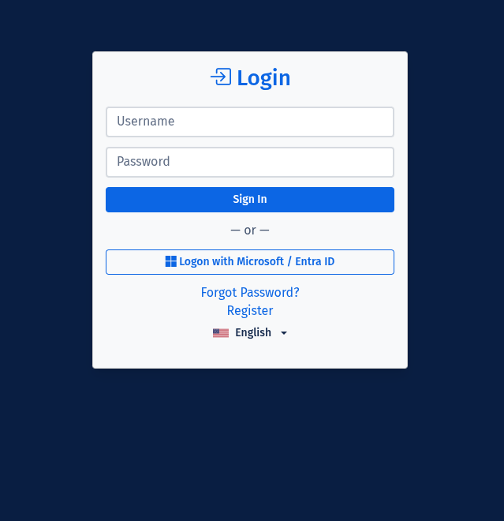
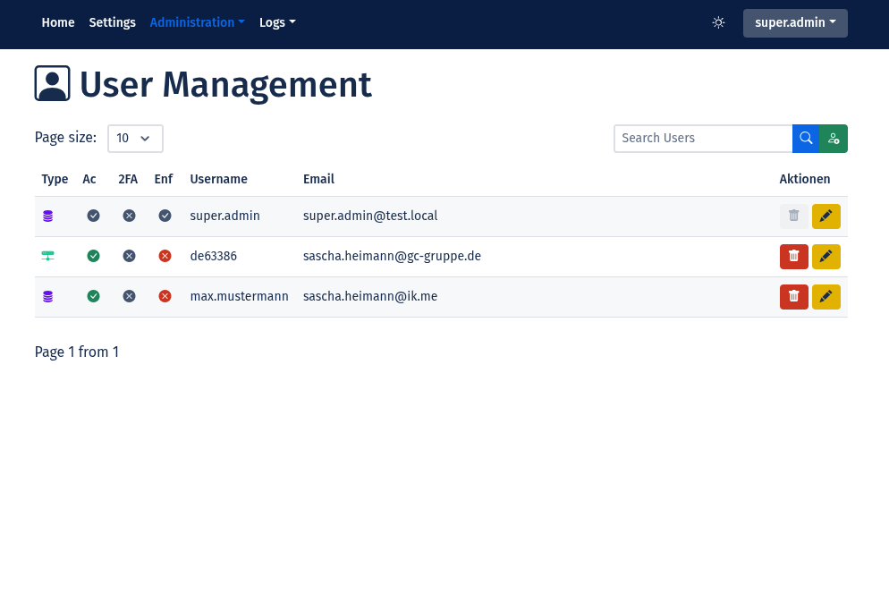
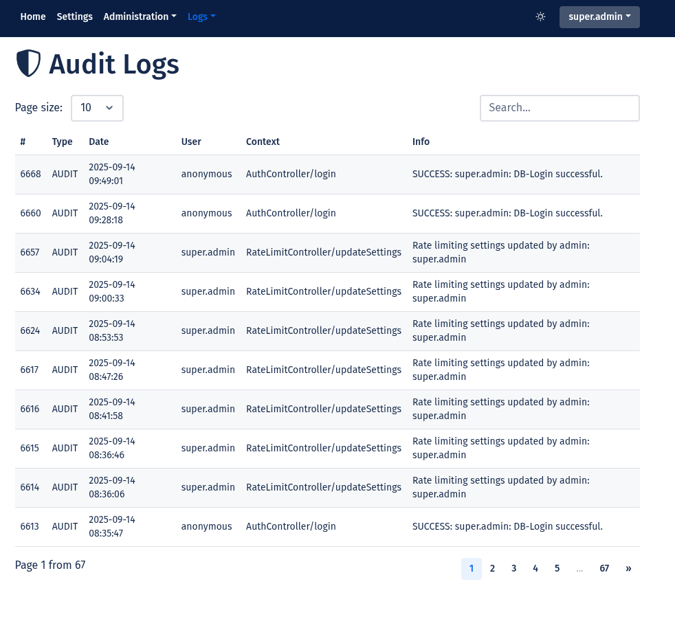

<div align="center">

# 🔐 SecStore
### *Moderne, sichere Benutzerverwaltung für das Web*

[](https://php.net)
[](LICENSE)
[](https://github.com/madcoda9000/SecStore/commits/main)
[](https://github.com/madcoda9000/SecStore)

**Eine vollständige Authentifizierungs- und Benutzerverwaltungsplattform mit modernen Sicherheitsfeatures und Enterprise-Ready-Funktionen.**

[📚 Dokumentation](Documentation/INSTALL.md) • [🚀 Live Demo](#) • [🐛 Bug Reports](https://github.com/madcoda9000/SecStore/issues) • [💬 Diskussionen](https://github.com/madcoda9000/SecStore/discussions)

</div>

---

## ✨ Warum SecStore?

<table>
<tr>
<td width="50%">

### 🛡️ **Sicherheit zuerst**
- **Zero-Trust-Architektur** mit Session Fingerprinting
- **2FA-Unterstützung** (TOTP) mit QR-Code-Setup
- **Advanced Rate Limiting** mit intelligenten Scopes
- **Real-time Security Dashboard** für Bedrohungsüberwachung

</td>
<td width="50%">

### ⚡ **Developer Experience**
- **Ein-Klick-Installation** mit automatischem Setup-Script
- **PSR-12 konform** mit Code-Qualitäts-Tools
- **Modern PHP 8.3+** mit Type Declarations
- **Latte Templates** für saubere, sichere Views

</td>
</tr>
<tr>
<td>

### 🌐 **Enterprise-Ready**
- **LDAP-Integration** für Corporate Environments
- **Granulare Rollenverwaltung** (RBAC)
- **Umfassendes Audit-Logging** aller Aktionen
- **Multi-Language Support** (DE/EN)

</td>
<td>

### 🎨 **Moderne UI/UX**
- **Bootstrap 5** Design
- **Dark/Light Mode** mit Benutzerpräferenzen\
<br>
<br>

 
  

</td>
</tr>
</table>

---

## 🚀 Quick Start

### **1-Minute Setup (Automatisch)**

```bash
# Repository klonen
git clone https://github.com/madcoda9000/SecStore.git
cd SecStore

# Automatisches Setup-Script ausführen
chmod +x setup.sh && ./setup.sh

# Konfiguration anpassen
cp config.php_TEMPLATE config.php
# -> DB-Zugangsdaten eintragen

# Development-Server starten
php -S localhost:8000 -t public
```

**🎉 Fertig! SecStore läuft unter http://localhost:8000**

**Standard-Login:** `super.admin` / `Test1000!` *(⚠️ Passwort sofort ändern!)*

### **Manuelle Installation**

Für detaillierte Installationsanweisungen und Produktions-Setup siehe **[📖 INSTALL.md](Documentation/INSTALL.md)**

---

## 🌟 Feature-Highlights

<details>
<summary><b>🔐 Authentifizierung & Sicherheit</b></summary>

- ✅ **Multi-Factor Authentication (MFA/2FA)** mit TOTP-Standard
- ✅ **LDAP-Integration** für Unternehmensanbindung
- ✅ **Session Security** mit Fingerprinting und Auto-Regeneration
- ✅ **Brute-Force-Schutz** mit intelligenten Sperrmechanismen
- ✅ **Password Security** mit BCRYPT-Hashing (60 Zeichen)
- ✅ **CSRF-Protection** für alle Formulare
- ✅ **Content Security Policy (CSP)** gegen XSS-Angriffe

</details>

<details>
<summary><b>⚡ Rate Limiting & DOS-Schutz</b></summary>

- ✅ **Granulares Rate Limiting** mit Scope-basierten Limits
- ✅ **Real-time Statistics** und Violation Tracking  
- ✅ **Intelligent Throttling** nach Sensitivität der Aktionen
- ✅ **Admin-Whitelist** Funktionen
- ✅ **Automatic Cleanup** und Block-Management

</details>

<details>
<summary><b>👥 Benutzerverwaltung</b></summary>

- ✅ **Rollenbasierte Zugriffskontrolle (RBAC)**
- ✅ **Flexible Benutzerverwaltung** mit Admin-Interface
- ✅ **Self-Service Profile** Management
- ✅ **Password Reset** via E-Mail (optional)
- ✅ **Registration System** (aktivierbar/deaktivierbar)
- ✅ **2FA-Enforcement** pro Benutzer durch Admins

</details>

<details>
<summary><b>📊 Monitoring & Logging</b></summary>

- ✅ **Security Dashboard** mit Real-time Übersicht
- ✅ **Comprehensive Logging** (Audit, Security, System, Mail, DB)
- ✅ **Log-Kategorien** mit granularer Konfiguration
- ✅ **Violation Tracking** und Threat Intelligence
- ✅ **Performance Metrics** und System Health

</details>

<details>
<summary><b>🎨 User Experience</b></summary>

- ✅ **Dark/Light Theme** mit automatischer Erkennung
- ✅ **Multi-Language** (Deutsch/Englisch)
- ✅ **Intuitive Admin-Interface**

</details>

---

## 📱 Screenshots

<div align="center">

### 🔑 Login & Authentication


### 👤 User Dashboard & Profile  


</div>

<details>
<summary><b>🖼️ Mehr Screenshots anzeigen</b></summary>

<div align="center">

| Admin-Bereich | Security Dashboard |
|:---:|:---:|
|  |  |

| Rate Limiting | Audit Logs |
|:---:|:---:|
|  |  |

| Settings | Registration |
|:---:|:---:|
|  |  |

</div>

</details>

---

## 🏗️ Technologie-Stack

<table>
<tr>
<td><b>Backend</b></td>
<td> </td>
</tr>
<tr>
<td><b>Frontend</b></td>
<td> </td>
</tr>
<tr>
<td><b>Database</b></td>
<td> </td>
</tr>
<tr>
<td><b>Security</b></td>
<td>  </td>
</tr>
<tr>
<td><b>Tools</b></td>
<td> </td>
</tr>
</table>

### 🔧 **Systemanforderungen**

| Komponente | Minimum | Empfohlen |
|------------|---------|-----------|
| **PHP** | 8.3+ | 8.3+ (neueste) |
| **MySQL/MariaDB** | 8.0+ / 10.4+ | 8.0+ / 10.6+ |
| **Webserver** | Apache 2.4 / Nginx 1.18 | Apache 2.4+ / Nginx 1.20+ |
| **RAM** | 512 MB | 1 GB+ |
| **Storage** | 100 MB | 500 MB+ |

---

## 📂 Projekt-Architektur

```
SecStore/
├── 📁 app/                    # Core Application
│   ├── Controllers/           # MVC Controllers
│   ├── Models/               # Data Models  
│   ├── Utils/                # Helper Classes
│   ├── Middleware/           # Request Middleware
│   └── views/                # Latte Templates
├── 📁 public/                # Web Root (Entry Point)
│   ├── css/                  # Stylesheets
│   ├── js/                   # JavaScript Files
│   └── index.php            # Application Bootstrap
├── 📁 Documentation/         # Project Documentation
│   ├── INSTALL.md           # Installation Guide
│   ├── CHANGELOG.md         # Version History
│   ├── SECURITY.md          # Security Policy
│   └── Screenshots/         # UI Screenshots
├── 📁 cache/                 # Template Cache
├── ⚙️ config.php            # Main Configuration
├── 🔐 generate_key.php      # Crypto Key Generator
├── 🚀 setup.sh             # Auto-Setup Script
└── 📋 composer.json         # Dependencies
```

---

## 🛠️ Entwicklung

### **Development Setup**

```bash
# Dependencies mit Dev-Tools installieren
composer install

# Code-Qualität prüfen
vendor/bin/phpcs                # PSR-12 Compliance Check
vendor/bin/php-cs-fixer fix     # Auto-Format Code

# Development Server
php -S localhost:8000 -t public
```

### **Beitragen**

Wir freuen uns über Beiträge! 🎉

1. **Fork** das Repository
2. **Branch** für neues Feature erstellen (`feature/amazing-feature`)
3. **Commit** Änderungen (`git commit -m 'Add amazing feature'`)
4. **Push** zum Branch (`git push origin feature/amazing-feature`)
5. **Pull Request** öffnen

**Coding Standards:**
- ✅ PSR-12 konformer PHP-Code
- ✅ Aussagekräftige Commit-Messages  
- ✅ Tests für neue Features
- ✅ Dokumentation aktualisieren

---

## 📖 Dokumentation

| Dokument | Beschreibung |
|----------|--------------|
| 📖 **[INSTALL.md](Documentation/INSTALL.md)** | Vollständige Installations- und Setup-Anleitung |
| 📝 **[CHANGELOG.md](Documentation/CHANGELOG.md)** | Versionshistorie und Release-Notes |
| 🔒 **[SECURITY.md](Documentation/SECURITY.md)** | Sicherheitsrichtlinien und Vulnerability-Reporting |
| 🏗️ **[API.md](#)** | API-Dokumentation (geplant) |
| 🐳 **[DOCKER.md](#)** | Docker-Setup (geplant) |

---

## 🤝 Community & Support

<div align="center">

### 💬 **Hol dir Hilfe**

[](https://github.com/madcoda9000/SecStore/issues)
[](https://github.com/madcoda9000/SecStore/discussions)
[](mailto:support@example.com)

</div>

### **❓ Häufige Fragen**

<details>
<summary><b>Kann SecStore in der Produktion eingesetzt werden?</b></summary>

Ja! SecStore wurde für Produktionsumgebungen entwickelt und implementiert moderne Sicherheitsstandards. Siehe [SECURITY.md](Documentation/SECURITY.md) für Details.
</details>

<details>
<summary><b>Unterstützt SecStore Single Sign-On (SSO)?</b></summary>

Über die LDAP-Integration können Sie SecStore an bestehende SSO-Lösungen anbinden. Native SAML/OAuth2-Unterstützung ist geplant.
</details>

<details>
<summary><b>Wie kann ich zum Projekt beitragen?</b></summary>

Wir freuen uns über Issues, Pull Requests, Dokumentation und Feature-Vorschläge! Siehe unsere Contributing-Guidelines oben.
</details>

---

## 📊 Project Stats

<div align="center">


</div>

---

## ⭐ Gib uns einen Star!

Wenn dir SecStore gefällt, gib uns einen ⭐ auf GitHub! Das motiviert uns, weiter an dem Projekt zu arbeiten.

<div align="center">

### 🙏 **Danke für dein Interesse an SecStore!**

*Gebaut mit ❤️ für die Open-Source-Community*

---

**[⬆️ Nach oben](#-secstore)**

</div>